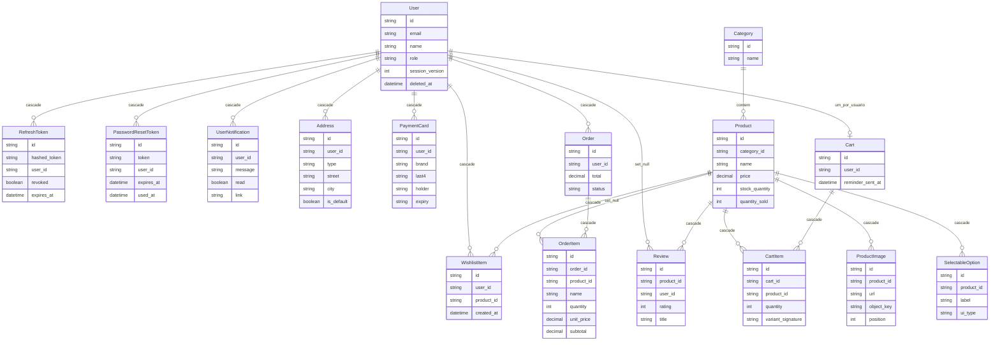

# Banco de dados

> **Navegação:**
> - [Visão geral](./README.md)
> - [Funcionalidades e Regras de Negócio](./FUNCIONALIDADES.md)
> - **Modelo de Dados**
> - [Fluxos](./FLUXO.md)

O backend usa **PostgreSQL** com **Prisma**. O schema está dividido em arquivos em [api/prisma/models/](./api/prisma/models/) e o datasource em [api/prisma/schema.prisma](./api/prisma/schema.prisma). O cliente Prisma é gerado em `api/src/database/client`.

---

## Diagrama de entidades (Mermaid)

Visão do modelo lógico: cardinalidade, tabelas mapeadas e FKs principais.

---

## Enums

| Enum (Prisma) | Valores |
|---------------|---------|
| `Roles` | `ADMIN`, `CUSTOMER`, `SUPPORT` |
| `OrderStatus` | `pending`, `delivered`, `intransit`, `cancelled` |
| `UIType` | `color`, `pill`, `select` |

---

## Restrições e deletes

| Tabela / modelo | Destaque |
|-----------------|----------|
| `cart_items` | `@@unique([cartId, productId, variantSignature])` |
| `wishlist_items` | `@@unique([userId, productId])` |
| `reviews` | `@@unique([productId, userId])` quando `userId` preenchido |
| `carts` | `userId` único (um carrinho por usuário) |
| `order_items` | `productId` opcional; `onDelete: SetNull` no produto |
| `reviews` | `userId` opcional; `onDelete: SetNull` no usuário |