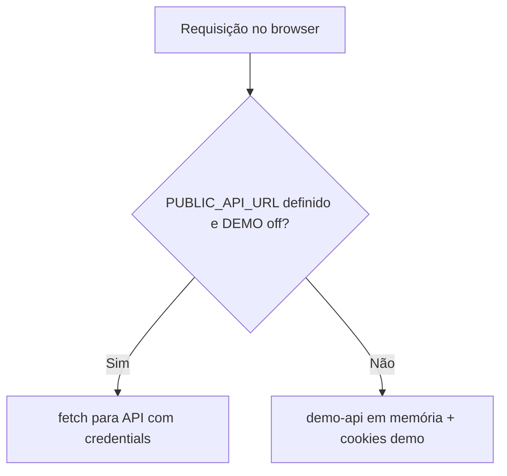

# Fluxos

> **Navegação:**
> - [Visão geral](./README.md)
> - [Funcionalidades e Regras de Negócio](./FUNCIONALIDADES.md)
> - [Modelo de Dados](./BANCO_DE_DADOS.md)
> - **Fluxos**

Descrição dos fluxos principais entre navegador, web (Astro) e API (Hono). Todos os fluxos autenticados assumem **mesmo site** e CORS com `credentials`, com cookies da API no domínio configurado em `FRONTEND_URL`.

---

## 1. Modo de dados: API real x demo

- **API real**: `PUBLIC_API_URL` apontando para o backend e `PUBLIC_DEMO_MODE` diferente de `true` (ou omitido conforme [web/src/lib/demo-mode.ts](./web/src/lib/demo-mode.ts)).
- **Demo**: sem URL pública da API ou com demo ligado; não há PostgreSQL no browser.

---

## 2. Login e sessão

1. Usuário envia e-mail e senha em `/login` (Preact).
2. O cliente chama `POST /auth/login` na API.
3. A API define cookies (access + refresh).
4. Redirecionamentos subsequentes podem chamar `GET /users/me` no servidor (Astro) com o header `Cookie` encaminhado (`serverGet` em [web/src/lib/serverApi.ts](./web/src/lib/serverApi.ts)).

**Refresh**: se uma página SSR receber `401` ao chamar a API, pode redirecionar para `/auth/refresh?redirect=...`. O fluxo de refresh usa `POST /auth/refresh` para renovar o access token e devolver o usuário à rota original.

**Logout**: fluxo via query `logout` no login que limpa sessão (e demo, se ativo).

---

## 3. Navegação na loja (SSR + hidratação)

1. Rotas como `/`, `/produtos` e `/produtos/[slug]` usam `serverGet` no Astro para `GET /products` e `GET /categories` **sem** exigir login.
2. Componentes interativos (`client:load`) usam [web/src/lib/request.ts](./web/src/lib/request.ts): em caso de `401`, tenta refresh automático e repete a chamada.

---

## 4. Carrinho

1. Usuário autenticado abre `/carrinho`.
2. O componente chama `GET /cart` (cria carrinho vazio no backend se necessário).
3. Alterar quantidade: `PATCH /cart/items/:cartItemId` com corpo `{ quantity }` (e opcionalmente variante, conforme contrato da API).
4. Remover: `DELETE /cart/items/:cartItemId`.

O identificador na URL é o **id do item no carrinho** (`cartItemId` na API), não o id do produto.

---

## 5. Checkout (atual)

1. Middleware implícito: `checkout/index.astro` exige header `Cookie`; senão redireciona para `/login`.
2. SSR paralelo: `GET /users/me` e `GET /cart`.
3. Se `401` em `/users/me`, redireciona para refresh com `redirect=/checkout`.
4. Monta resumo (subtotal, itens) e renderiza o wizard de etapas no cliente.

**Importante**: a etapa final é **apresentação** (PIX, cartão, boleto simulados na UI). Para persistir pedido no banco, o cliente precisaria chamar `POST /orders` (já implementado na API com regras de estoque e snapshot). Hoje essa chamada não está ligada ao botão de conclusão do checkout na web.

---

## 6. Perfil do cliente

1. `/perfil` SSR com `GET /users/me`.
2. Abas exibem estruturas aninhadas: `ordersHistory`, `personalData`, `addresses`, `paymentCards`, `wishlistProducts`.
3. Ações de edição (quando implementadas no componente) devem refletir `PATCH /users/me`, endereços e cartões conforme rotas em [api/README.md](./api/README.md).

---

## 7. Painel admin

1. `/admin` exige cookies.
2. `GET /users?limit=1` com escopo `ADMIN`: se `403`, redireciona para `/`; se `401`, manda para refresh com `redirect=/admin`.
3. No cliente, abas carregam listagens (`/users`, `/orders`, categorias, produtos) e ações de escrita (criar categoria/produto, atualizar status de pedido, upload de imagem via fluxo pré-assinado).

---

## 8. Pedido no backend (referência)

Fluxo **interno** da API ao receber `POST /orders` (resumo):

1. Resolver itens (carrinho ativo ou lista no body).
2. Em transação: carregar produtos e opções, validar variantes, calcular subtotais com desconto.
3. Atualizar estoque atômico (`stockQuantity` / `quantitySold`); falha se quantidade insuficiente.
4. Criar `Order` e `OrderItem` (snapshot); esvaziar carrinho se origem for carrinho.

---

## 9. Recuperação de senha (API)

1. `POST /auth/forgot-password` com e-mail: enfileira envio com link contendo token (comportamento anti-enumeração na resposta).
2. `POST /auth/reset-password` com token e nova senha: valida token, atualiza senha, incrementa sessão e revoga refresh tokens.

A web pode apontar o link para uma rota Astro que chame o passo 2; isso fica a cargo de evolução do front.
